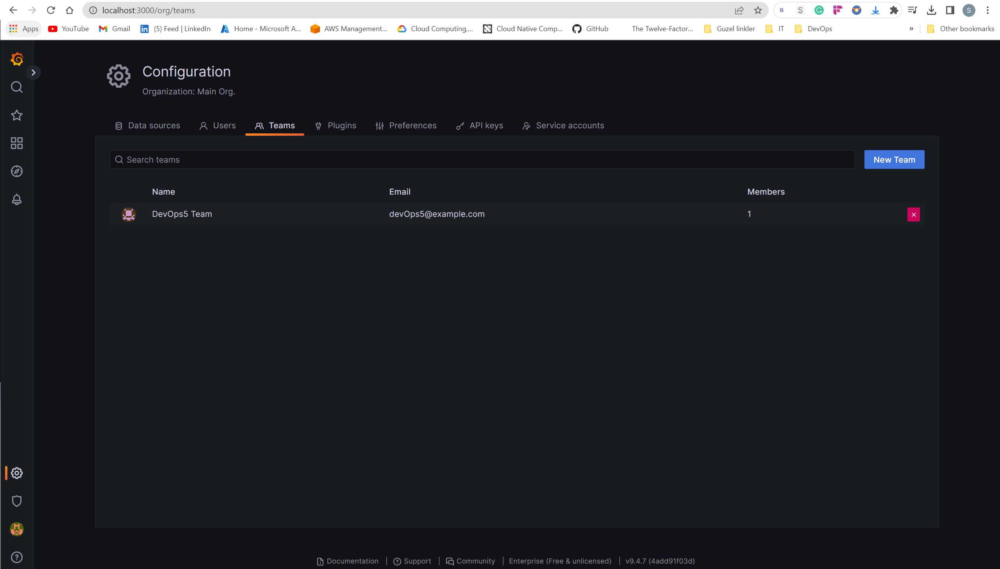
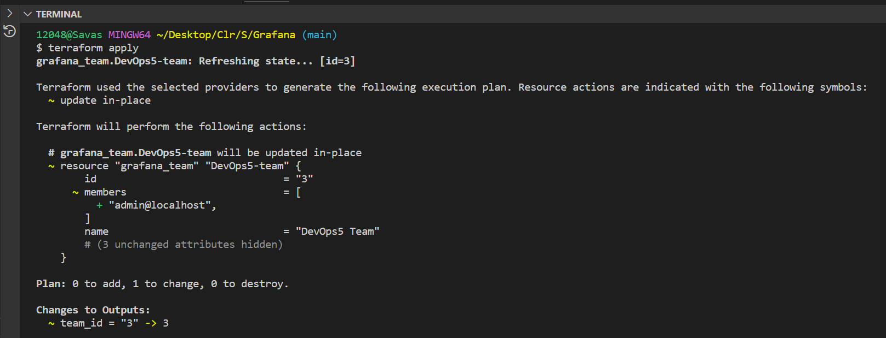
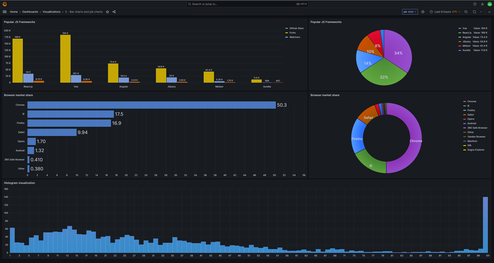
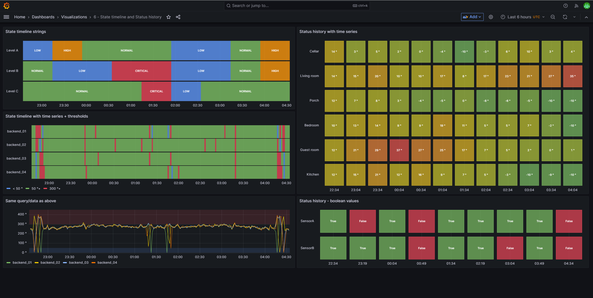
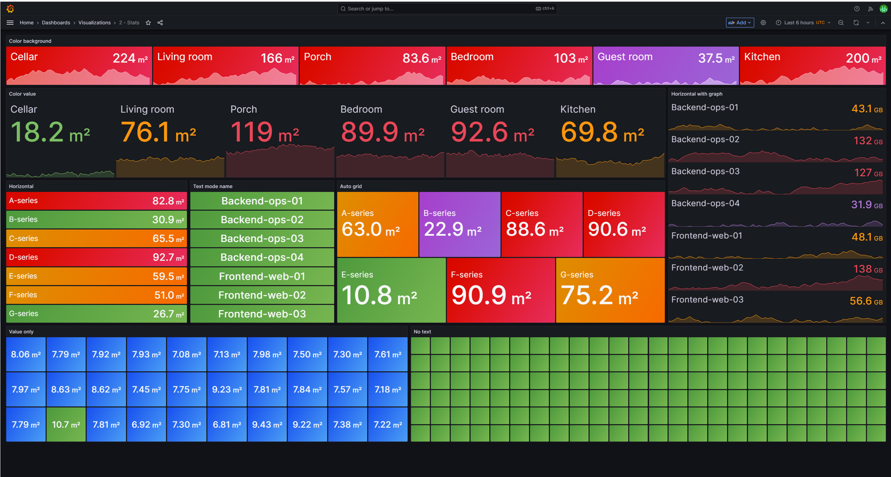

# Grafana Team Deployment with Terraform
Terraform configuration files to deploy a team environment in Grafana on your local machine. With this configuration, you can set up multiple teams with different permissions and roles to manage Grafana dashboards and data sources.

#### DevOps Team


## Deployment Steps

+ Terraform Commands

```
terraform init
terraform plan
terraform apply
```

```
team_id (Number) The team id assigned to this team by Grafana.
```


+ Once the deployment is complete, navigate to the Grafana UI in your web browser at http://localhost:3000/ and log in with the credentials provided in the output.

+ You can create teams and assign users to them by going to the "Teams" tab in the Grafana UI. Each team can have its own set of permissions and roles to manage dashboards and data sources

## Grafana

Grafana is an open-source, data visualization and monitoring tool. It allows users to create interactive and customizable dashboards to display time-series data from various sources.

## Features
+ Dashboard creation: Create and customize dashboards with panels that display data in various formats such as graphs, tables, and heatmaps.

#### Bar charts and pie charts


#### State timeline and Status history


#### Stats



+ Data source integration: Connect to various data sources such as databases, APIs, and cloud services to visualize data in real-time.
+ Alerting: Set up alerts to receive notifications via email or other channels when specific conditions are met.
+ Templating: Use variables to create dynamic dashboards that can filter data based on user input.
+ Plugins: Extend the functionality of Grafana with plugins developed by the community or create custom plugins.


## Installation
+ Download the latest version of Grafana from the official website.
+ Install Grafana following the instructions for your operating system.
+ Once installed, navigate to the Grafana UI in your web browser at http://localhost:3000/ and log in with the default credentials (admin/admin).

## Cloud-Hosted Options
+ Grafana Cloud: A fully managed, cloud-hosted Grafana service with built-in Prometheus data source, alerts, and Grafana plugins. Sign up for a free trial here.
+ AWS Marketplace: Deploy Grafana on AWS with just a few clicks. Learn more here.
+ Azure Marketplace: Deploy Grafana on Azure with pre-configured data sources and dashboards. Learn more here.


